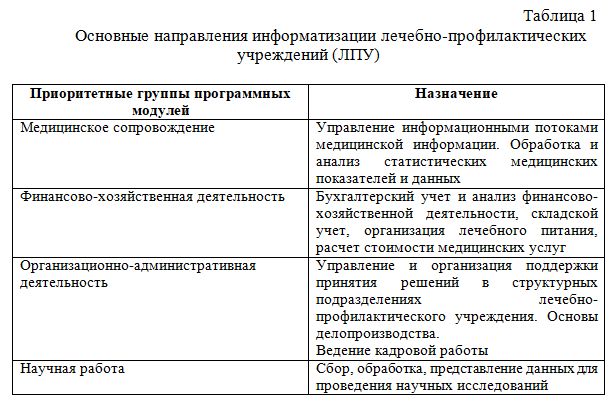
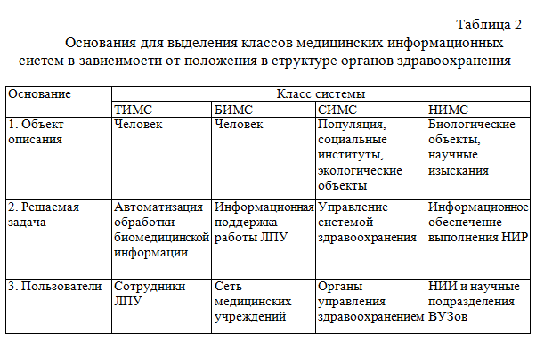

# Медицинские информационные системы

Развитие медицинской отрасли, как науки, так и практической деятельности, интенсивно повышает информационный обмен в данной сфере, в том числе за счет внедрения компьютерных технологий. Основу системы информационного обеспечения здравоохранения составляют многочисленные количественные данные – специальные демографические, эпидемиологические и административные показатели. Это, например, данные социологических опросов, маркетинговых исследований, различной статистической документации, экспертные оценки, фонды медицинских библиотек, системы сбора и переработки информации.

Информационный и документальный поток медицинских данных достаточно специфичен, и для того чтобы деятельность службы здравоохранения была эффективной, необходимо четко представлять все ее особенности.

Главная цель информатизации здравоохранения в целом может быть сформулирована следующим образом: создание новых информационных технологий на всех уровнях управления здравоохранением и новых медицинских компьютерных технологий, повышающих качество лечебно-профилактической помощи и способствующих реализации основной функции охраны здоровья населения – увеличение продолжительности активной жизни.

На основе данной концепции можно выделить следующие направления использования предметно-ориентированных информационных систем:

- формирование целостного информационного пространства в системе здравоохранения, обеспечивающего ускоренный доступ к медицинской информации, качество медицинских документов и т. д.;
- мониторинг здоровья населения – комплексный, научно-обоснованный анализ динамики развития состояния здоровья населения на основе социальных, экономических и других факторов;
- управление оказанием медицинской помощи и мониторинг ее качества, обеспечивающие снижение вероятности возникновения врачебной ошибки, устранение избыточности назначений;
- развитие информационного обеспечения актуальных программ борьбы с социально-значимыми заболеваниями, широкое использование информационных технологий в научно-практических программах по борьбе с массовыми заболеваниями (СПИД, сахарный диабет, туберкулез, болезни органов кровообращения и др.);
- информатизация системы управления в области здравоохранения, повышающая производительность труда медицинских работников, параметры качества лечебно-диагностического процесса, эффективности медицинской деятельности учреждений здра­воохранения, прозрачности деятельности медицинского учреждения;
- оптимизация, повышение эффективности использо­вания ресурсов здравоохранения, обеспечивающие управление мате­риально-техническими, кадровыми и другими ресурсами здравоохранения;
- телемедицина – использование информационных технологий в целях оказания медицинской помощи населению.

Разработка проектов информатизации здравоохранения осуществляется на нескольких уровнях в зависимости от объема решаемых задач. Выделяют следующие уровни проектов:

- государственный уровень (федеральный);
- территориальный (региональный);
- уровень ЛПУ;
- уровень медико-технологических информационных систем.

## Основные тенденции, проблемы и факторы информатизации системы здравоохранения

В современной практике информатизации системы здравоохранения можно выделить множество взаимосвязанных тенденций, которые обусловлены как развитием программно-технических средств, так и развитием и совершенствованием собственно информационных технологий, связанных с массовым использованием компьютерных сетей, накоплением информационных ресурсов, повышением уровня компьютерной грамотности и т. д.

Развитие методов и технологий программной инженерии, внедрение новых инструментальных средств, CASE-технологий, появление и использование новых технических средств обусловливают целый ряд тенденций в развитии информационных технологий в целом, которые существенным образом влияют на изменение характера рабочих процессов. Среди тенденций, связанных с изменением программно-технической реализации информационных технологий, выделим следующие:

- переход от закрытых и жестких информационных систем к открытым, расширяемым, масштабируемым и адаптируемым системам – к системам с открытой архитектурой;
- широкое использование технологий Интернет/Интранет, использование Web-браузеров в качестве универсального рабочего места;
- возрастание роли телекоммуникаций, переход от локальных к распределенным информационным системам, построенным на сочетании децентрализованных и централизованных режимов хранения и обработки данных. При этом на верхние уровни могут выноситься не только базы данных, доступные по сети, в том числе через Интернет и Web-сайты, но и приложения;
- использование технологий беспроводного доступа к ресурсам информационных систем («мобильный пользователь»);
- стандартизация информационных потоков и структур хранения данных на основе спецификаций XML и их стандартизации;
- использование RAD- и CASE-технологий, методов прототипирования и макетирования, объектно-компонентных архитектур (CORBA, СОМ и проч.), промежуточного программного обеспечения (middelware) для интеграции приложений;
- использование технологий централизованного дистанционного (удаленного) администрирования и сопровождения;
- использование технологий бесклавиатурного ввода (считывания) данных (линейные и двумерные штрих-коды, оптическое считывание и распознавание символов и др.), в том числе средств дистанционного, бесконтактного считывания данных, а также технологий рукописного ввода и распознавания символов (сенсорные панели и экраны) и т. д.;
- использование технологий речевого ввода и вывода (распознавание/синтез речи);
- использование персональных машиночитаемых носителей данных (пластиковые карты, с чипами памяти и микропроцессорами) и т. д.

Важнейшими тенденциями и факторами, определяющими изменения в характере и содержании рабочих процессов, профессиональной структуре отрасли, системе подготовки кадров и методах менеджмента, являются следующие:

- отчуждение, обобществление и коллективное использование информационных ресурсов, формируемых различными пользователями;
- расширение использования публичных информационных ресурсов, доступных через сеть Интернет, что делает весьма актуальными проблемы семантической идентификации информационных ресурсов и их поиска;
- расширение диапазона автоматизируемых задач, функций и рабочих процессов, через которые реализуется профессиональная деятельность сотрудников медицинских учреждений, в том числе лечебно-диагностических функций, включая процессы принятия решений по тактике лечения;
- усложнение состава и структуры обрабатываемой информации, в том числе необходимость использования разнородной слабоструктурированной информации, графической, видео- и аудиоинформации (мультимедиа). Это, например, медицинские изображения, а также сигналы от различных датчиков и диагностического оборудования;
- переход от автоматизации учетных процедур к информатизации управления, включая процессы прогнозирования, планирования и принятия решения, в том числе по тактике лечения;
- переход от автоматизации отдельных задач к созданию полнофункциональных интегрированных информационно-технологических, в том числе медико-технологических комплексов (переход к «сквозным» технологиям);
- переход к интерактивным режимам работы и алгоритмам решения задач многошаговой обработки данных (анализ, моделирование, расчеты, оптимизация, диагностика, планирование);
- развитие электронного документооборота, в связи с принятием федерального закона «Об электронной цифровой подписи»;
- использование мультимедийных и web-технологий делает актуальным переход к интерактивным полиморфным документам;
- переход от автоматизации фиксированного набора функций (характерного для первых поколений АРМов) к формированию гибких, адаптируемых, расширяемых автоматизированных технологий; использование технологий групповой работы (GroupWare) и управления потоками работ (WorkFlow);
- унификация интерфейса конечного пользователя на основе «де-факто» стандарта «GUI-Windows», метафоры «рабочего стола», что способствует повышению мобильности пользователя – одному из важнейших требований открытых систем;
- использование ассистирующих процедур, встроенных Help- и обучающих систем;
- применение интеллектуальных агентов для выполнения заданных действий (сценариев, «поручений») и др.

Содержательно процесс внедрения современных информационных технологий и создания интегрированных информационных систем должен заключаться в рационализации и эффективной организации рабочих процессов с использованием различных программно-технических средств и телекоммуникаций. Опыт создания и использования автоматизированных информационных систем убедительно показал, что рациональное сочетание и интеграция применяемых различных программных и технических средств и базовых информационных технологий позволяет получить положительный синергетический (системный) эффект.

Анализ современных информационных технологий привел к выводу, что в составе перспективных многофункциональных информационных систем в здравоохранении могут быть эффективно использованы технологии и средства:

- создания экспертных систем и баз знаний и систем управления корпоративными знаниями;
- гипертекста и гипермедиа (в том числе в электронной медицинской карте, в системах поддержки принятия решения по тактике лечения, в экспертно-диагностических системах и базах знаний, в консультативных и обучающих системах и др.);
- технологии аналитической обработки OLAP (On-Line Analytical Processing), многомерного моделирования (MultiDimensional Modelling) и интеллектуального анализа (Data Maining) данных, многомерных хранилищ (Data Warehouse) и витрин (Data Mart) данных, а также современные технологии репортинга (формирования отчетности);
- системы календарного планирования и управления проектами;
- бесклавиатурного ввода данных на основе использования машиночитаемых носителей информации (пластиковых карточек, документов с визуальным кодированием и т. д.);
- работы с архивами и сетевого хранения данных.

При этом необходимо исходить из того, что каждое средство или технология имеет свою область эффективности, выявление и апробация которой возможна только на основе опыта практического использования.

## Разработка и внедрение автоматизированных систем управления в здравоохранении

Создание и эксплуатация информационных систем и автоматизированных систем управления в здравоохранении преследуют ряд целей:

- совершенствование организационной структуры управления отдельного участка работы лечебно-профилактического учреждения или учреждения здравоохранения в целом;
- оптимизация производственных процессов, связанных с лечением и контролем за состоянием здоровья пациентов, а также диагностических, лечебных и других видов работ, выполняемых в лечебно-профилактическом учреждении;
- совершенствование документации и системы документооборота лечебно-профилактического учреждения;
- автоматизация процессов получения, сбора, хранения, поиска, передачи и использования информации, формируемой на всех этапах деятельности сотрудников лечебно-профилактического учреждения.

### Существуют два основных варианта внедрения информационных систем.

Вариант I. Комплексная автоматизация. Разработка информационных систем производится для обеспечения максимального охвата средствами автоматизации всех участков обработки информации и выполняется в сжатые сроки. Наиболее предпочтительный, но и самый дорогостоящий вариант.

Вариант II. Поэтапная автоматизация. Автоматизация деятельности отдельных участков с возможностью их дальнейшего объединения в единую систему. Позволяет распределить финансовые затраты во времени и постепенно приспособить производственный цикл к требованиям автоматизированных систем управления.

Основные этапы разработки и внедрения автоматизированных систем управления:

- обследование объекта автоматизации – концепция автоматизации в форме служебной или докладной записки;
- технико-экономическое обоснование и финансирование проекта – составление сметы расходов и ориентировочное планирование затрат;
- техническое проектирование – проект автоматизированной системы управления;
- инженерно-технические работы – приобретение и установка оборудования и программного обеспечения, отладка и настройка;
- ввод в эксплуатацию – обучение персонала, подготовка информационных баз данных, опытная эксплуатация.

Медицинская информационная система должна отвечать современным требованиям и строится на базе ключевых принципов. Комплексный подход к созданию системы, концепция которого основана на разработке базовой платформы, на которую, в свою очередь, добавляются отдельные модули, предназначенные для решения конкретных задач. При этом создаваемые модули должны учитывать основные направления деятельности лечебного учреждения, что неразрывно связано с развитием его информационной инфраструктуры.

Основные направления информатизации лечебно-профилактических учреждений (ЛПУ) представлены в табл. 1.

Следует отметить, что между программными модулями нет четких границ. Так, задачи научной работы тесно связаны с медицинским сопровождением пациентов, и в то же время для их решения могут быть необходимы результаты экономических расчетов или любая другая информация.

Основными видами информационных ресурсов, к которым может предоставляться удаленный доступ, являются следующие:

- справочно-информационные системы, научно-периодические издания, интернет-ресурсы, то есть медицинские базы знаний;
- базы данных пациентов для доступа к амбулаторным картам и архивам историй болезни, результатам лабораторных исследований и т. д.;
- организационно-справочная информация: электронные телефонные справочники, календари, модули с расписанием работы и планированием рабочего времени и др.

Оценка эффективности функционирования медицинских систем производится по ряду направлений:

1. Управленческая эффективность. Оценивается по оперативности, достоверности и адекватности управленческих решений, принимаемых на основе использования данных, обрабатываемых информационной системой.

2. Медицинская эффективность работы системы выражается в повышении качества диагностики заболеваний, адекватности назначений и выполнения медицинских услуг, уменьшении продолжительности заболеваний, уменьшении инвалидизации и др.

3. Социальные аспекты оценки эффективности работы медицинской информационной системы могут быть определены на основании анализа динамики демографических характеристик (рождаемость, смертность, продолжительность жизни и др.), а также по критериям обеспеченности и доступности медицинской помощи населению.

4. Экономическая эффективность достигается за счет оптимизации затрат на обеспечение медикаментами, уменьшения выплат по временной нетрудоспособности и инвалидности, сокращения затрат времени на проведение медицинских и технологических манипуляций, сокращения численности и уменьшения фонда оплаты труда вспомогательного персонала и др.

Медицинские информационные системы преследуют одну основную цель: ускорение и облегчение хранения и обработки данных на различных уровнях управления медицинской деятельностью.

## Классификация медицинских информационных систем

При классификации по функциональному признаку выделяют следующие предметно-ориентированные медицинские системы:

1. ​ Системы управления здравоохранением на федеральном и территориальном уровнях.

2. Автоматизированные системы управления (АСУ) специализированных медицинских служб. Используются в структурах скорой помощи, психиатрической службе, аптечной сети и т. д.

3. Управление лечебно-профилактическими учреждениями (АСУ-поликлиника, АСУ-стационар, АСУ-диспансер, АСУ-санаторий и др.).

4. Управление учебными заведениями здравоохранения. Применяются в системе подготовки кадров здравоохранения в средних и высших образовательных учреждениях.

5. Информационная поддержка работы медицинского персонала: автоматизированные рабочие места врача, медицинской сестры, заведующего отделением, главного врача и др.

6. Информационное обеспечение экстренной медицинской помощи при чрезвычайных ситуациях (медицина катастроф).

7. Мониторинг состояния здоровья населения (системы профилактических осмотров).

8. Информационное обеспечение научно-медицинской работы.

9. Системы информационного обмена (автоматизированные библиотеки, телемедицинские системы).

При классификации по такому признаку, как глубина работы с медицинской картой пациента, выделяют предметно-ориентированные медицинские системы:

- Departmental systems – cистемы, которые работают только с определенной частью данных медицинской карты. В качестве примера можно привести лабораторные системы, фармакологические системы для реанимационных отделений и т. п.;
- CPR systems – системы, которые работают с медицинской картой в целом.

Рассматривая классификацию медицинских информационных систем во взаимосвязи с их местом в структуре учреждений здравоохранения, можно выделить ряд классов:

а) медицинские технологические системы. Находятся непосредственно между больным и врачом, обеспечивая информационную поддержку диагностических и профилактических процессов, процесса лечения, реабилитации пациентов в лечебных учреждениях:

- мониторные системы и приборно-компьютерные комплексы средств для постоянного, интенсивного наблюдения за состоянием больных в послеоперационных палатах, реанимационных отделениях;
- системы вычислительной диагностики;
- системы клинико-лабораторных исследований, включая программно-аппаратные комплексы средств для функциональной, лабораторной и рентгеновской диагностики;
- экспертные системы, основанные на базах знаний экспертов в конкретной медицинской области;
- системы передачи и обработки изображений, представляющих медико-биологическую информацию;

б) системы управления предприятием объединяют несколько участков или все информационные ресурсы предприятия. К ним относятся АСУ-поликлиника, АСУ-стационар и т. д. Как правило, включают ряд модулей, соответствующих структуре предприятия (планирование, финансовое обеспечение, снабжение, медицинская деятельность и другие);

в) банки данных коллективного пользования. В качестве объекта приложения этих систем выступают информационные ресурсы человечества. Например, специализированные справочные базы данных по болезням, диагностике, литературным источникам, статистическим данным и др.;

г) банки информации медицинских служб накапливают и обобщают данные о группах пациентов. Эта информация востребована, как правило, многими медицинскими работниками: врачами, средним медицинским персоналом, руководителями ЛПУ и т. д.;

д) справочно-информационные медицинские системы представляют собой совокупность медицинской информации для обеспечения информационной поддержки медицинских учреждений;

е) статистические медицинские системы разных служб в области здравоохранения служат для накопления и обработки медицинских данных о популяции. Их применяют руководители здравоохранения;

ж) научно-исследовательские информационные медицинские системы применяются в научно-исследовательских институтах и подразделениях ВУЗов для решения комплексных задач медицины и здравоохранения;

з) обучающие медицинские информационные системы предназначены для обеспечения процесса обучения в медицинских учебных заведениях.

Перечисленные выше медицинские информационные системы в различной степени соотносятся с уровнями управления медицинской деятельностью и в связи с этим занимают соответствующее положение между врачом и пациентом. Основания для выделения классов медицинских информационных систем, в зависимости от положения в структуре органов здравоохранения, приведены в табл. 2.

Под телемедицинскими технологиями понимают медицинские технологии, реализуемые с применением средств телекоммуникаций (телемедицина):

- лечебно-диагностические телемедицинские консультации;
- телемониторинг (телеметрия) функциональных показателей больного;
- телемедицинское функциональное (лабораторное) обследование;
- телемедицинские совещания (консилиумы) и симпозиумы, реализуемые с помощью средств видеоконференцсвязи;
- удаленный доступ к информационным ресурсам в области медицины, представленным в сети Интернет, с помощью Web-серверов ИС лечебно-профилактических учреждений.

При классификации по структуре выделяют предметно-ориентированные медицинские системы:

- локальные, расположенные в пределах одного предприятия (здания, помещения);
- глобальные, распространяющиеся на город, регион и более.

Распространенность и создание различных типов информационных систем зависят не только от финансовых возможностей отрасли или предприятия. Во многом это определяется сложностью их изготовления и сопровождения.

В зависимости от сложности и трудоемкости изготовления информационные системы подразделяются на четыре уровня.

1 уровень – наиболее простой с точки зрения изготовления и поддержания работоспособности системы. К этому уровню относятся автоматизированные системы обработки данных, которые выполняют вычислительные операции по заранее известным алгоритмам. Это статистическая обработка данных, бухгалтерские расчеты и т. д.

2 уровень – более сложный. Включает информационные и информационно-справочные системы, эффективность работы которых зависит от возможностей, удобства и понятного пользователю механизма формирования поисковых запросов, а также от регулярного обновления информации.

3 уровень – включает автоматизированные системы управления технологическим процессом предприятия в целом. Они должны обеспечивать обработку информации в реальном времени, производить ее обобщение и представление для последующего анализа и принятия окончательных управленческих решений человеком. В этих системах используются логические операции выбора, обобщения и группировки информации, реализация которых в программном виде зачастую очень сложна.

4 уровень – наиболее сложный. На этом уровне находятся экспертные системы и автоматизированные системы диагностики заболеваний. Экспертной системой (ЭС) называют компьютерную программу, созданную на базе широких экспертных знаний, предназначенную для обеспечения высокоэффективного решения задач в узкой предметной области. Такие системы должны обладать свойствами прообраза искусственного интеллекта и моделировать процесс мышления человека.

В здравоохранении встречаются практически все из названных выше типов автоматизированных систем. С учетом специфики отдельных структурных составляющих здравоохранения, а также функциональной составляющей медицинские информационные системы подразделяются на виды.

## Обзор основных медицинских информационных систем

Существующие на сегодня информационные системы, используемые в медицинских учреждениях и аптеках, применяются для решения задач различного уровня.

### Лабораторная информационная система «Промедичи ЛИС»

«Промедичи ЛИС» (компания «Промедичи», www.promedichi.ru) – разработанная с учетом рекомендаций ведущих европейских и российских экспертов в области организации лабораторных процессов система управления деятельностью медицинской лаборатории.

Лабораторная информационная система предназначена для выполнения следующих задач:

– формирование единой информационной базы лаборатории или группы лабораторий;
– управление всеми бизнес-процессами деятельности лаборатории, включая планирование, взаимоотношения с контрагентами, организацию логистики, финансовый анализ, управление персоналом, лабораторными процессами, и полная их автоматизация.

Лабораторная информационная система «Промедичи ЛИС» обладает следующими характеристиками:

- применение экспертных технологий, обеспечивающих: определение эффективных маршрутов прохождения лабораторных процессов при их диспетчеризации; предоставление справочной информации о проводимой операции и методе в целом; оказание помощи в интерпретации результатов исследований; выявление противоречивых и неправдоподобных результатов исследований; уточнение и оптимизация норм расхода реагентов и расходных материалов при проведении лабораторных исследований;
- интеграция с внешними системами, например, ГИС, кадровыми, бухгалтерскими системами, системами обязательного медицинского страхования;
- взаимодействие с разнообразным лабораторным оборудованием и использование различных технологий (штрих-кодирование, RFID-технологии, работа с системами идентификации персонала);
- гибкость системы, изменение последовательности и правил выполнения действий, процессов и операций;
- поддержка международных и российских стандартов и регламентирующих документов;
- возможность использования бесплатного серверного и клиентского ПО.

Система не требует значительных вложений в инфраструктуру. Четко документированный, распланированный и формализованный процесс внедрения позволяет запустить систему в эксплуатацию в кратчайшие сроки, без ущерба для деятельности лаборатории.

### Автоматизированная медицинская информационная система «Интрамед»

Автоматизированная медицинская информационная система «Интрамед», разработанная компанией «Медкор», отличается высоким уровнем автоматизации бизнес-процессов лечебно-профилактического учреждения:

- создания базы данных историй болезни и амбулаторных карт на основе электронной медицинской карты пациента (ЭМК);
- экспертной работы;
- формирования стандартов лечения;
- ведения плана и очереди на госпитализацию;
- ведения расписания работы врачей;
- учета функционирования коечного фонда;
- персонифицированного учета медицинских услуг;
- персонифицированного предметно-количественного учета медикаментов в ЛПУ;
- учета материально-технических ресурсов ЛПУ;
- формирования учетных документов;
- формирования государственной и отраслевой статистической отчетности.

ЭМК является электронным аналогом стандартных форм Министерства здравоохранения РФ «Медицинская карта амбулаторного больного» (форма 025/у+87) и «Медицинская карта стационарного больного» (форма 003/у).

Медицинская информационная система «Интрамед» охватывает следующие службы и рабочие места ЛПУ:

- главного врача и его заместителей;
- рабочие места в регистратуре, приемном покое;
- заведующих отделениями;
- рабочие места во всех параклинических службах (в лаборатории, врачей лечебно-диагностических отделений; в отделе лучевой диагностики, в физиотерапии и т. д.);
- старших медсестер отделений;
- рабочие места в аптеке;
- отделе кадров, в статистике;
- постовых, палатных, процедурных медсестер;
- специалистов экономической службы и договорного отдела;
- системных администраторов и программистов.

Основные системные решения, используемые в медицинской информационной системе «Интрамед»:

- трехуровневая архитектура клиент-сервер;
- интернет-технологии («тонкий клиент»);
- обмен данными с использованием языка XML.

### Медицинская информационная система РИАМС

Группа компаний «Медкор» работает более 10 лет на рынке медицинского оборудования и медицинских информационных технологий в России, странах СНГ и Балтии. Для повышения эффективности в решении кардинальных задач органов управления здравоохранением и обязательного медицинского страхования (ОМС), а также в целях улучшения организации системы управления здравоохранением и ОМС компания «Медкор» предлагает реализовать проект по формированию автоматизированной региональной информационно-аналитической медицинской системы (РИАМС).

Реализация проекта позволит решить следующие задачи:

- паспортизация учреждений здравоохранения;
- формирование единой системы учета ресурсов здравоохранения региона;
- мониторинг ресурсной обеспеченности населения ресурсами здравоохранения;
- формирование единого территориального регистра населения;
- персонифицированный учет и мониторинг оказанной медицинской помощи, затрат на медицинскую помощь, лекарственной помощи и затрат на нее, заболеваемости населения;
- формирование территориальной программы государственных гарантий.

Эффективность внедрения программы

Внедрение информационно-аналитической системы позволяет разработать эффективную стратегию развития систем здравоохранения и обязательного медицинского страхования на основе системного анализа и своевременной диагностики организационных и финансовых проблем, формирования качественно новых подходов к управлению здравоохранением, адекватную социально-экономической ситуации.

Реализация проекта обеспечит снижение затрат на информатизацию систем здравоохранения и обязательного медицинского страхования за счет:

- комплексного использования информационных ресурсов;
- единого программного обеспечения для всех однотипных организаций и учреждений;
- сокращения трудозатрат на подготовку отчетов и документов;
- сокращения командировок, связанных с проверкой достоверности информации, представляемой учреждениями в вышестоящие организации;
- отсутствия необходимости в выделенных каналах связи.

### Системы автоматизации лабораторных исследований ALTEY Laboratory

Системы автоматизации лабораторных исследований ALTEY Laboratory, разработанные ООО «Комплексные медицинские информационные системы», предназначены для комплексной автоматизации технологических и бизнес-процессов в медицинских диагностических лабораториях.

Продукты ALTEY Laboratory отличает универсальность, модульная структура, простота и гибкость настройки. Результатом внедрения систем ALTEY Laboratory является повышение производительности лаборатории (в среднем не менее чем на 30 %, а по многим видам исследований – на сотни процентов), превращение трудоемких сложных процессов в легкую, интересную, поддающуюся анализу и планированию, коммерчески привлекательную работу. ALTEY Laboratory обеспечивает автоматизацию полного спектра исследований, проводимых современной клинико-диагностической лабораторией: биохимические, гематологические, иммунологические, серологические, аллергологические, микробиологические, ПЦР-исследования и многие другие методики, выполняемые на анализаторах или вручную. Системой учитываются особенности приема и нумерации заказов, расчета услуг и выписки счетов, организации работ, разделения труда в лаборатории. Обеспечивается обмен данными с лабораторным оборудованием. Результаты проходят процедуру авторизации. Ведутся электронные журналы регистрации исследований, лабораторная статистика, контроль качества. Открытая архитектура системы обеспечивает ее полноценную интеграцию с другими медицинскими информационными системами, работающими в медучреждении. Линейка продуктов ALTEY Laboratory покрывает потребности в автоматизации лабораторий разной производительности, начиная с небольших (100–200 биоматериалов/день) и заканчивая крупными диагностическими комплексами (десятки анализаторов, 3000‒6000 биоматериалов/день).

Достигаемые преимущества:

- полная автоматизация документооборота лаборатории;
эффективное использование лабораторного оборудования и, как следствие, повышение производительности;
- использование современных методик при проведении лабораторного контроля качества;
- оперативное предоставление лечащим врачам результатов лабораторных исследований;
- повышение «прозрачности» и управляемости лабораторного бизнеса;
- адаптивность системы к задачам конкретной лаборатории, ее гибкость, взаимодействие с другими медицинскими информационными системами;
- система разработана с использованием современных подходов к созданию открытых промышленных систем;
- специальная технология подключения лабораторных анализаторов, позволяющая в короткие сроки подключать практически любые приборы ведущих мировых производителей: ROCHE, ABBOTT, TECAN, BIO-RAD, LABSYSTEMS и др.;
- учёт любых видов услуг по действующим на территории Российской Федерации правилам страховой и коммерческой медицины и возможность легко анализировать и адаптировать правила учета к изменяющейся рыночной ситуации;
- развитые средства интеграции на базе современных WEB-технологий, открывающие большие перспективы для организации эффективной городской и региональной лабораторной службы на базе специализированных лабораторий, действующих в едином информационном пространстве.

В дополнение к существенному отличию в стоимости данной системы от западных аналогов, она является тиражируемой промышленной системой, позволяющей в короткие сроки автоматизировать практически любую медицинскую лабораторию. Данная технология позволяет обучать местных (региональных) технических специалистов с целью адаптации системы к существующим задачам, подключения к системе лабораторного оборудования и её интеграции с уже действующими в ЛПУ системами Истории болезни, ОМС, договорного отдела и т. д. Накоплен большой положительный опыт интеграции с медицинскими информационными системами производства третьих фирм.

Система автоматизации лабораторных исследований ALTEY Laboratory является уникальной, относительно недорогой (оптимальное соотношение цена/качество), максимально пригодной к широкому тиражированию на российском рынке информационных систем медицинского назначения.
